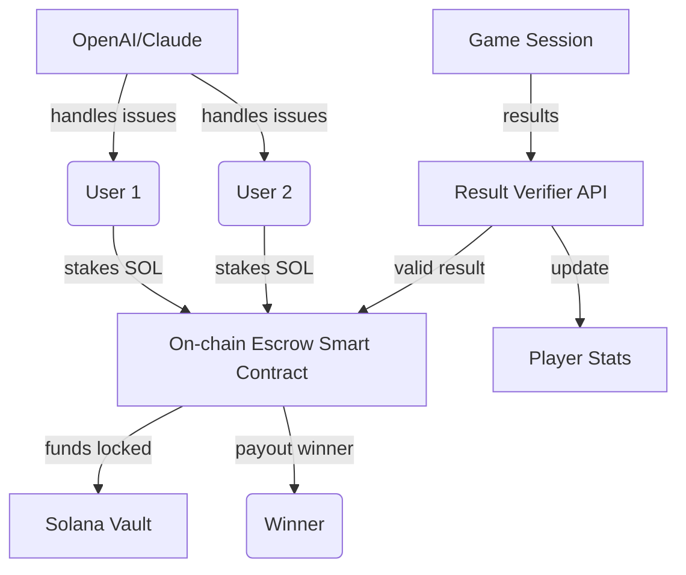

# 🎲 NAME Arena: Decentralized Wagering Platform for Multiplayer Gaming 

  
**Seamless, Secure, and Social Wagering for Modern Gamers**

---

## 🎮 Project Overview

Welcome to **NAME Arena**, the cutting-edge decentralized wager marketplace for multiplayer gaming, supercharged by Solana! Inspired by the trustless chess wager concept, this project elevates the experience by allowing players to stake SOL on **custom skill-based games** — from classic checkers to trendy word challenges. Funds are secured in on-chain escrow, outcomes are validated by **external and internal game engines/APIs**, and winnings are distributed automatically. We've built a future-proof, gamified, and fully automated platform using Next.js, TypeScript, Tailwind, and Solana Web3. 

**Multilingual, accessible, and always open — with AI insights and support superpowers.**

---

## 🚀 Feature Highlights

- **Trustless On-chain Escrow:** Smart contracts ensure no party can unilaterally access the staked funds.
- **Modular Game Integration:** Plug-and-play support for Chess, Checkers, Wordle-style games, Sudoku duels, and more.
- **Winner Verification APIs:** Secure outcome validation via both third-party (e.g., Lichess, external Sudoku APIs) and built-in servers.
- **Instant Automated Payouts:** No waiting, no middleman — winner gets paid the moment the game ends.
- **Responsive Modern Interface:** Next-gen UI/UX with light/dark mode, PWA readiness, and touch optimization.
- **Multilingual Support:** English, Spanish, Mandarin, German, French — customizable locale configs.
- **24/7 AI Customer Support:** Built-in integration with OpenAI and Claude AI for live multilingual help and dispute resolution.
- **Comprehensive Player Profile System:** Track match stats, earnings, favorite games, and badges.
- **Seamless Social Features:** Friend invites, rematches, community highlights.
- **Detailed Game Result Logs:** Transparency with cryptographically signed outcomes.
- **Open-source, MIT-licensed:** Extensible and audit-ready.

---

## 📱 OS Compatibility Table

| Platform      | Browser          | Native App Support | Touch/Tablet Ready |
|:--------------|:----------------|:------------------|:------------------|
| 🪟 Windows    | Chrome, Edge     | PWA               | Yes               |
| 🍏 macOS      | Safari, Chrome   | PWA               | Yes               |
| 🐧 Linux      | Chrome, Firefox  | PWA               | Yes               |
| 🤖 Android    | Chrome           | PWA, APK Beta     | Yes               |
| 🍎 iOS        | Safari           | PWA               | Yes               |

---

## 🕹 New Paradigm of Game-based Staking (SEO: decentralized gaming escrow, Solana gaming, P2P game wagers)

Imagine a global arcade, open 24/7, where you can wager on your skills across numerous classic and modern games, with AI-powered support always at your side. **NAME Arena** blends the thrill of multiplayer competition with the auditable trustlessness of Web3, welcoming both casual gamers and seasoned strategists.

---

## 🗺️ Architectural Diagram

---

## 🗂️ Example Profile Configuration

Players can personalize their experience with flexible JSON profile settings:

{
  "username": "QuantumGambler",
  "language": "es-ES",
  "favoriteGames": ["Checkers", "Wordle Challenge"],
  "preferredStakes": ["0.05", "0.1"],
  "notifications": {
    "winAlerts": true,
    "friendRequests": true,
    "reminders": false
  },
  "ai_assist": true,
  "dark_mode": false
}

---

## 💻 Example Console Invocation

Ready for headless deployment, automation, and scripting! Here’s a typical CLI session:

NAME-arena-cli wager --game=checkers --opponent=OxabcDEF123 --stake=0.1 --lang=fr --ai-support=true

Output:
> Challenge sent to OxabcDEF123 for Checkers (Stake: 0.1 SOL, Language: French, AI Support: Enabled).  
> Waiting for opponent to join...

---

## 🤖 OpenAI & Claude API Integration

- **Live Help & Dispute Resolution:** Real-time multilingual chat and automated FAQ powered by OpenAI's GPT-4 and Claude API.
- **AI Game Insights:** Get AI-generated post-match analysis, strategic suggestions, and learning resources.
- **Automatic Translation:** Seamless translation of in-game chat and user interfaces.

API endpoints are securely configured and modular for expansion to any major LLM service.

---

## 🌟 Key Features At a Glance

- ✨ **Decentralized Wagering:** P2P, non-custodial staking — your funds, your games, your rules.
- 🌍 **Global Multilingual UI:** Five+ languages out of the gate, easily extensible.
- 🤝 **AI-First Support System:** 24/7 always-on support for any question or dispute.
- 🧩 **Plugin Architecture:** Developers can add new games and APIs via bespoke modules.
- 🔐 **Verifiable Transparency:** Open-source, inspectable contracts, and auditable game results.
- 📈 **Profile/Stats Engine:** Track your rise in the global arena!
- 🖥 **Modern, Responsive Design:** Enjoy on desktop, mobile, or as a standalone PWA.

---

## 🔑 SEO-Friendly Keywords & Use Cases

- **Decentralized gaming escrow for Solana**
- **Trustless P2P multiplayer wagers**
- **On-chain skill gaming marketplace**
- **SOL staking for e-sports and quick matches**
- **AI-powered gaming support**
- **Instant payout wager arena**

**Unlock the new dimension of global, secure, and effortless multiplayer contests.**

---

## 📦 Getting Started

Ready to stake your claim? Download the platform package right here:

  

> See our quick start and developer guides in `/docs` for integration details and API walkthroughs.

---

## ⚖️ License

This project is licensed under the MIT License.  
Please see [LICENSE](./LICENSE) for details.

---

## ❗ Disclaimer

NAME Arena is a decentralized gaming utility platform. By using this project, you acknowledge the risks inherent in staking and decentralized technologies. Game results are governed by third-party APIs and transparent smart contracts; always play responsibly. This is an open-source project intended for compliant, ethical, and legal use in your jurisdiction.  
Year: 2026

---

## 📦 Download the Future of Skill Gaming!

  

---

Happy staking, smart gaming, and see you in the arena!